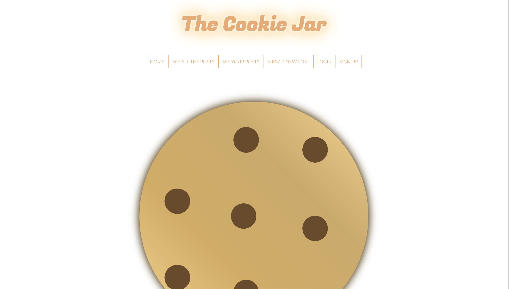

# FAC19 week 6 project

At [Founders and Coders](https://www.foundersandcoders.com/about/) coding bootcamp we are tasked every week with a different project. A MVP is built in 1.5 days by 4 developers that follow the Agile methodology.

__Week 6 topic__: Authentication

---

See [week 6 schedule](https://founders-and-coders.gitbook.io/coursebook/week-6/schedule).

---

# The cookie jar

## Installation Guide
* git clone this repo
* `npm install` to set up node modules
* Initialise a local database
* Create .env file in project route
* Add PGDATABASE variable in your .env file and assign to initialised database
* `npm run dev` will start nodemon server

